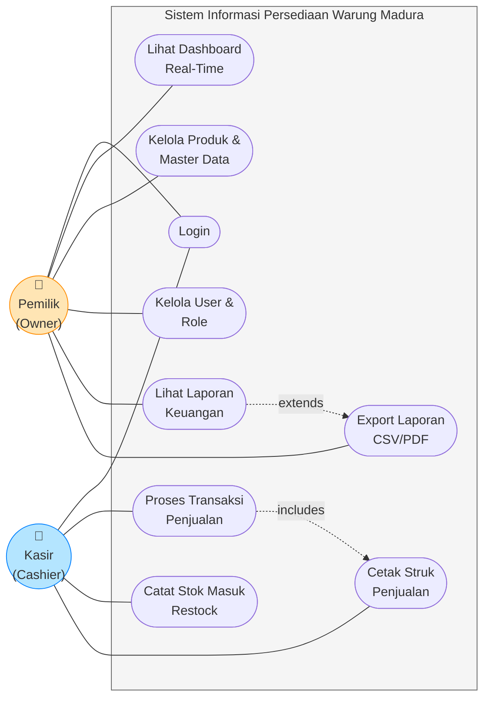
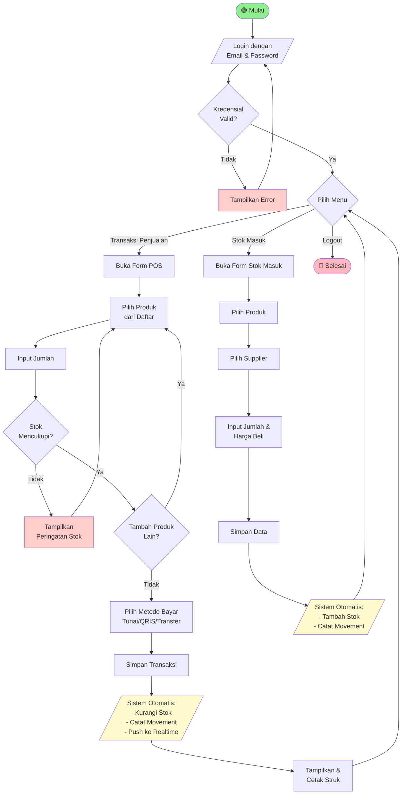
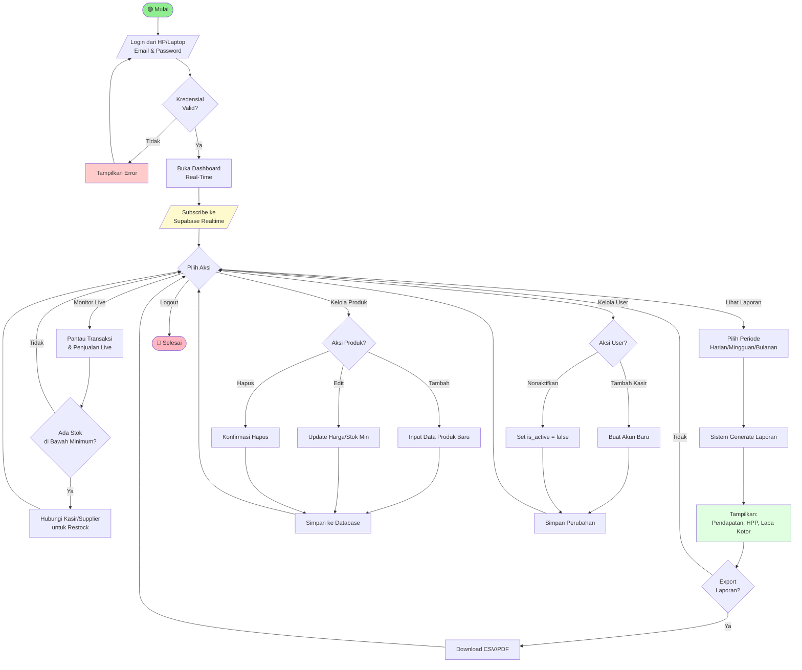
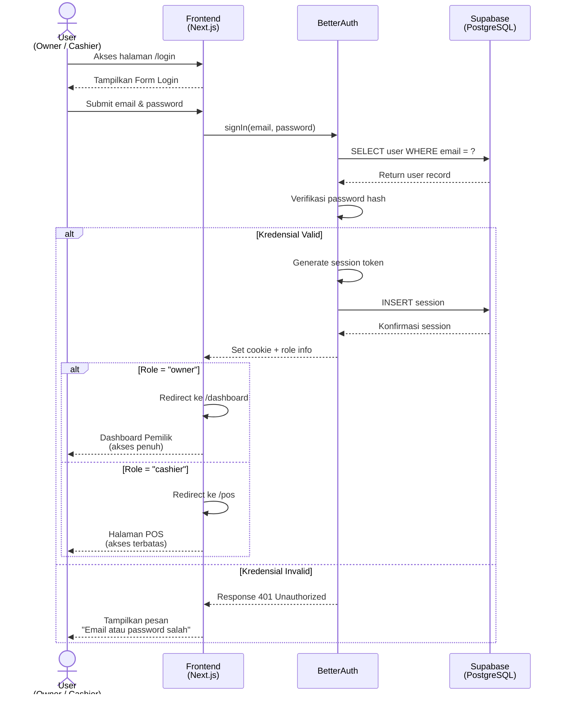
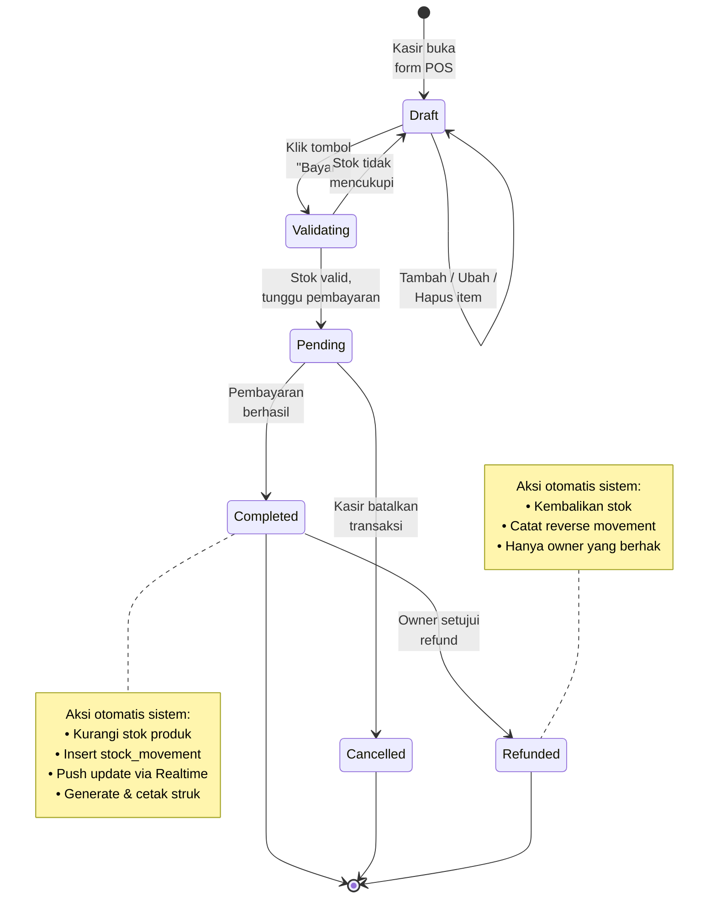
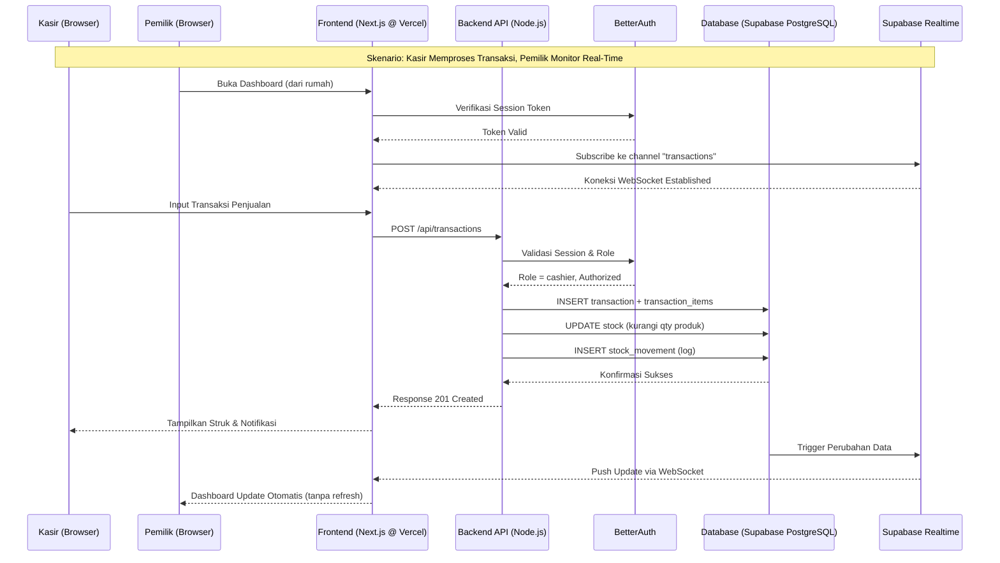
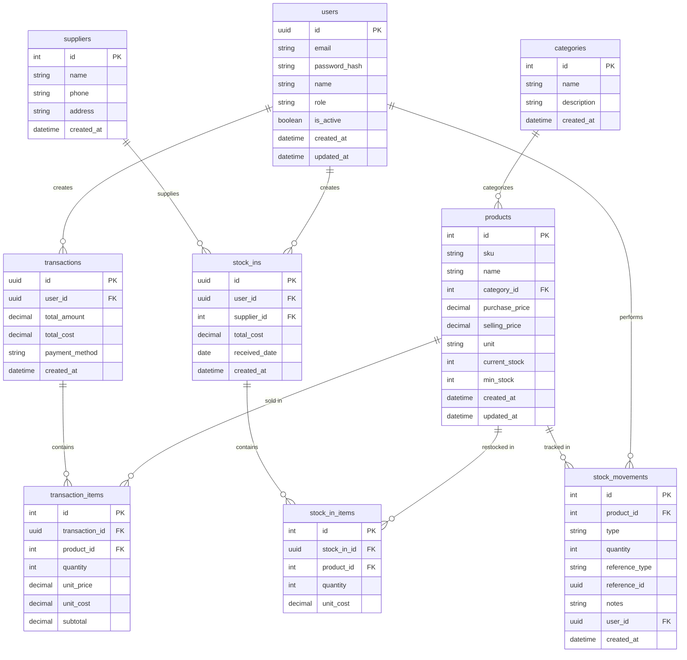
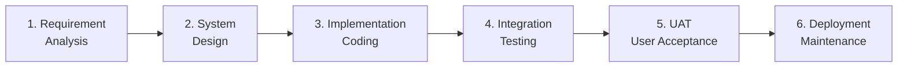

# PRD — Project Requirements Document

**Nama Proyek:** Pengembangan Sistem Informasi Persediaan Barang Berbasis Web dengan Fitur Pemantauan Stok Real-Time dan Laporan Keuangan Terintegrasi untuk Warung Madura

## 1. Overview
Aplikasi ini bertujuan untuk mendigitalkan pencatatan stok dan transaksi penjualan pada Warung Madura, yang selama ini umumnya dilakukan secara manual menggunakan buku catatan. Masalah utama yang ingin diselesaikan adalah **ketidakmampuan pemilik untuk memantau stok dan transaksi secara langsung ketika tidak berada di lokasi warung**, sehingga pemilik sulit mengambil keputusan bisnis (misalnya kapan harus kulakan/restock atau apakah kasir melakukan pencatatan dengan benar) secara cepat dan akurat.

Tujuan utama aplikasi adalah menyediakan platform berbasis web yang **real-time** dan **multi-device**, sehingga pemilik dapat memonitor operasional warung dari mana saja (HP, tablet, atau laptop), sementara kasir tetap dapat mencatat transaksi harian dengan mudah. Sistem juga akan mengotomatisasi pencatatan stok masuk/keluar berdasarkan transaksi, serta menyediakan laporan penjualan dan keuangan yang terintegrasi.

## 2. Requirements
Berikut adalah persyaratan tingkat tinggi untuk pengembangan sistem:
- **Aksesibilitas:** Aplikasi harus dapat diakses melalui Web Browser pada berbagai perangkat (smartphone, tablet, laptop, desktop) dengan tampilan **responsif**.
- **Pengguna:** Sistem mendukung **multi-user** dengan role terpisah, yaitu **Pemilik (Owner)** dan **Kasir (Cashier)**. Setiap role memiliki hak akses yang berbeda.
- **Real-Time Sync:** Perubahan data (transaksi, stok) yang dilakukan oleh kasir di warung harus **langsung tersinkronisasi** dan dapat dilihat oleh pemilik tanpa perlu refresh manual.
- **Otomatisasi Stok:** Stok produk harus otomatis berkurang saat terjadi transaksi penjualan, dan otomatis bertambah saat ada pencatatan stok masuk (restock).
- **Laporan Terintegrasi:** Sistem menyediakan laporan penjualan harian, mingguan, dan bulanan, termasuk kalkulasi keuntungan kotor (gross profit) berdasarkan harga beli dan harga jual.
- **Keamanan:** Autentikasi wajib untuk semua pengguna menggunakan email dan password. Data sensitif (password) harus di-hash.
- **Cloud-Based:** Aplikasi dideploy di cloud agar dapat diakses dari mana saja tanpa infrastruktur lokal di warung.

## 3. Core Features
Fitur-fitur kunci yang harus ada dalam versi pertama (MVP):

1.  **Dashboard Real-Time**
    - Ringkasan total penjualan hari ini, jumlah transaksi, dan produk terlaris.
    - **Panel Peringatan Stok Rendah:** Daftar produk yang stoknya di bawah batas minimum.
    - Grafik tren penjualan 7 hari terakhir.
    - Indikator sinkronisasi real-time (live indicator).
2.  **Manajemen Produk (Master Data)**
    - Tambah, Edit, Hapus, dan Lihat daftar produk.
    - Kolom wajib: Nama Produk, SKU/Barcode, Kategori, Harga Beli, Harga Jual, Satuan, Stok Saat Ini, dan Minimum Stok.
    - Pengelolaan kategori produk (Makanan Ringan, Minuman, Rokok, Sembako, dll).
3.  **Pencatatan Transaksi Penjualan (Point of Sale)**
    - Form kasir untuk input transaksi penjualan.
    - Pilih produk, input jumlah, dan sistem otomatis kalkulasi total.
    - Dukungan beberapa metode pembayaran (Tunai, QRIS, Transfer).
    - Cetak/tampilkan struk digital setelah transaksi sukses.
    - **Stok otomatis berkurang** setelah transaksi tersimpan.
4.  **Pencatatan Stok Masuk (Restock/Kulakan)**
    - Form untuk mencatat barang masuk dari supplier.
    - Input: Pilih Produk, Jumlah, Harga Beli, Supplier, dan Tanggal.
    - **Stok otomatis bertambah** setelah pencatatan disimpan.
5.  **Laporan Penjualan & Keuangan Terintegrasi**
    - Laporan penjualan harian, mingguan, dan bulanan.
    - Kalkulasi otomatis: Total Pendapatan, Total Modal (HPP), dan Laba Kotor.
    - Export laporan ke format CSV/PDF.
    - Filter berdasarkan rentang tanggal, kategori, dan kasir.
6.  **Manajemen User & Role**
    - Pemilik dapat menambah/menghapus akun kasir.
    - Dua role: `owner` (akses penuh) dan `cashier` (akses terbatas pada transaksi).

## 4. User Flow
Alur kerja aplikasi dibagi berdasarkan role pengguna. Berikut visualisasi UML untuk memudahkan pemahaman:

### 4.1 Use Case Diagram
Diagram berikut menggambarkan interaksi antara aktor (Pemilik & Kasir) dengan fitur-fitur sistem:

**Keterangan Hak Akses:**
| Use Case | Pemilik | Kasir |
|----------|:-------:|:-----:|
| Login | ✅ | ✅ |
| Dashboard Real-Time | ✅ (full) | ✅ (terbatas) |
| Kelola Produk | ✅ | ❌ (read-only) |
| Kelola User | ✅ | ❌ |
| Laporan Keuangan | ✅ | ❌ |
| Transaksi Penjualan | ✅ | ✅ |
| Stok Masuk | ✅ | ✅ |

### 4.2 Activity Diagram — Alur Kasir (Cashier)
Diagram aktivitas berikut menggambarkan langkah-langkah operasional kasir saat menggunakan sistem di warung:

### 4.3 Activity Diagram — Alur Pemilik (Owner)
Diagram aktivitas berikut menggambarkan alur monitoring dan manajemen yang dilakukan pemilik dari jarak jauh:

### 4.4 Sequence Diagram — Login & Role-Based Routing
Diagram sekuens berikut menggambarkan urutan interaksi antar komponen sistem saat user melakukan login. Sistem akan otomatis mengarahkan user ke halaman yang sesuai dengan role-nya (Owner → Dashboard, Cashier → POS):

**Catatan Keamanan:**
- Setiap request API selanjutnya akan menyertakan session cookie yang divalidasi oleh BetterAuth.
- Middleware Next.js akan memeriksa role sebelum mengizinkan akses ke route tertentu (misalnya `/laporan` hanya untuk owner).

### 4.5 State Diagram — Siklus Hidup Transaksi
Diagram state berikut menggambarkan perubahan status sebuah transaksi penjualan dari dibuat hingga selesai. Ini membantu developer memahami logika bisnis dan validasi yang harus diterapkan di setiap tahap:

**Penjelasan State:**

| State | Deskripsi | Boleh Diakses Oleh |
|-------|-----------|---------------------|
| **Draft** | Transaksi sedang disusun, belum disimpan ke DB | Cashier, Owner |
| **Validating** | Sistem mengecek ketersediaan stok | Sistem (otomatis) |
| **Pending** | Menunggu konfirmasi pembayaran (untuk QRIS/Transfer) | Cashier, Owner |
| **Completed** | Transaksi berhasil, stok sudah dikurangi | — (final state) |
| **Cancelled** | Transaksi dibatalkan sebelum pembayaran | — (final state) |
| **Refunded** | Transaksi di-refund, stok dikembalikan | Hanya Owner |

### 4.6 Ringkasan Naratif
**Alur Kasir (Cashier):**
1.  Login menggunakan email dan password di perangkat warung (tablet/laptop).
2.  Saat pembeli datang, membuka menu "Transaksi Baru", memilih produk, input jumlah, memilih metode pembayaran, lalu menyimpan.
3.  Sistem otomatis mengurangi stok, mencatat transaksi, dan mencetak struk.
4.  Saat supplier mengirim barang, membuka menu "Stok Masuk", input data, lalu simpan — stok bertambah otomatis.

**Alur Pemilik (Owner):**
1.  Login remote dari HP/laptop di lokasi mana pun.
2.  Memantau Dashboard real-time untuk melihat transaksi live, total penjualan hari ini, dan stok yang menipis.
3.  Membuka menu "Laporan" untuk melihat rekap harian/bulanan dan menganalisis laba kotor.
4.  Mengelola master data produk dan akun user kasir kapan pun diperlukan.

## 5. Architecture
Berikut adalah gambaran arsitektur sistem dan aliran data, khususnya mekanisme sinkronisasi real-time antara kasir dan pemilik:

**Penjelasan Alur:**
- **Frontend (Next.js)** di-deploy di Vercel dan menjadi antarmuka untuk semua pengguna.
- **Backend Logic** dijalankan via Next.js API Routes (Node.js runtime) untuk memproses request bisnis.
- **BetterAuth** menangani session management dan role-based access control.
- **Supabase** menyediakan PostgreSQL sebagai database sekaligus **Supabase Realtime** untuk mekanisme WebSocket yang memungkinkan sinkronisasi data live ke dashboard pemilik.

## 6. Database Schema

Berikut adalah Entity Relationship Diagram (ERD) yang menggambarkan struktur database utama:

| Tabel | Deskripsi |
|-------|-----------|
| **users** | Data pengguna sistem dengan role `owner` atau `cashier`. Dikelola oleh BetterAuth. |
| **categories** | Kategori produk (contoh: Minuman, Makanan Ringan, Rokok, Sembako). |
| **products** | Master data produk, termasuk harga beli, harga jual, stok, dan batas minimum. |
| **suppliers** | Data supplier/pemasok tempat warung kulakan barang. |
| **transactions** | Header transaksi penjualan, mencatat total, metode bayar, dan kasir yang input. |
| **transaction_items** | Detail item per transaksi, menyimpan harga jual dan harga beli saat transaksi terjadi (snapshot untuk akurasi laporan laba). |
| **stock_ins** | Header pencatatan stok masuk/restock dari supplier. |
| **stock_in_items** | Detail item per transaksi stok masuk. |
| **stock_movements** | Log audit semua pergerakan stok (IN/OUT), terhubung ke transaksi atau stock_in sebagai referensi. |

## 7. Design & Technical Constraints
Bagian ini mengatur batasan teknis dan panduan desain yang wajib dipatuhi selama pengembangan.

1.  **Technology Stack (Wajib):**
    Sistem dibangun menggunakan stack teknologi yang telah ditetapkan untuk menjaga konsistensi, performa, dan kemudahan deployment:
    -   **Frontend (UI & Tampilan User):** `Next.js` — menggunakan App Router dan React Server Components untuk performa optimal dan SEO-friendly.
    -   **Backend (Logic & API Server):** `Node.js` — diimplementasikan via Next.js API Routes atau Route Handlers, sehingga backend & frontend berada dalam satu codebase monorepo.
    -   **Database (Penyimpanan Data):** `PostgreSQL` via `Supabase` — sekaligus memanfaatkan fitur **Supabase Realtime** untuk WebSocket subscription pada tabel `transactions` dan `stock_movements`.
    -   **Deployment (Hosting & Infra):** `Vercel` — auto-deploy dari Git dengan CI/CD otomatis, SSL, dan CDN global.
    -   **Authentication:** `BetterAuth` — untuk sign-in email/password, session management, dan role-based access control (RBAC).

2.  **Typography Rules:**
    Sistem antarmuka (UI) wajib menggunakan konfigurasi font variable sebagai berikut untuk menjaga konsistensi visual:
    -   **Sans:** `Geist Mono, ui-monospace, monospace`
    -   **Serif:** `serif`
    -   **Mono:** `JetBrains Mono, monospace`

3.  **Responsiveness & UX:**
    -   Aplikasi wajib mobile-first (karena pemilik sering mengakses via HP).
    -   Halaman POS (kasir) dioptimasi untuk tablet dengan touch-friendly buttons (minimum 44x44px).
    -   Semua interaksi krusial (simpan transaksi, hapus produk) harus memberikan feedback visual (loading state, toast notification).

4.  **Performance Constraints:**
    -   Waktu response API untuk transaksi penjualan harus di bawah **500ms** (kritis untuk pengalaman kasir).
    -   Initial page load (LCP) maksimal **2.5 detik** di koneksi 4G.

5.  **Security Constraints:**
    -   Semua endpoint API wajib diverifikasi session-nya oleh BetterAuth.
    -   Role `cashier` tidak boleh mengakses endpoint manajemen user, manajemen produk (hanya read), dan laporan keuangan.
    -   Password wajib di-hash menggunakan algoritma yang disediakan BetterAuth (tidak pernah disimpan plaintext).

## 8. Development Methodology
Pengembangan sistem menggunakan metodologi **Waterfall** yang dilengkapi dengan fase **User Acceptance Testing (UAT)** di akhir. Pendekatan ini dipilih karena kebutuhan sudah relatif stabil dan terdefinisi jelas dalam PRD ini, sehingga cocok dengan pendekatan sekuensial.

### 8.1 Fase Waterfall

| Fase | Deliverable Utama | Estimasi Durasi |
|------|-------------------|-----------------|
| **1. Requirement Analysis** | Dokumen PRD final, wawancara dengan pemilik warung | 1 minggu |
| **2. System Design** | ERD, wireframe UI, API contract, arsitektur teknis | 2 minggu |
| **3. Implementation** | Kode frontend (Next.js), backend (Node.js), skema DB (Supabase), integrasi BetterAuth | 6 minggu |
| **4. Integration Testing** | Unit test, integration test, bug fixing | 2 minggu |
| **5. UAT** | Skenario uji oleh pemilik & kasir, dokumen hasil UAT, revisi berdasarkan feedback | 2 minggu |
| **6. Deployment** | Aplikasi live di Vercel, dokumentasi user, training kasir | 1 minggu |

### 8.2 Skenario UAT (User Acceptance Testing)
UAT dilakukan langsung di warung dengan pemilik dan kasir sebagai penguji. Beberapa skenario utama yang akan diuji:

1.  **UAT-01: Login Multi-Device**
    Pemilik login dari HP di rumah, bersamaan dengan kasir yang login di tablet warung. Kedua session harus berjalan independen.
2.  **UAT-02: Transaksi Penjualan Real-Time**
    Kasir melakukan transaksi, dan pemilik harus melihat update di dashboard dalam waktu <3 detik tanpa refresh manual.
3.  **UAT-03: Akurasi Stok Otomatis**
    Setelah 10 transaksi penjualan, cek apakah stok di master produk sesuai (stok awal - total terjual).
4.  **UAT-04: Stok Masuk**
    Kasir mencatat kedatangan barang dari supplier, stok harus bertambah sesuai input.
5.  **UAT-05: Laporan Keuangan**
    Generate laporan penjualan harian, cek akurasi total pendapatan, total HPP, dan laba kotor.
6.  **UAT-06: Role-Based Access**
    Akun kasir mencoba mengakses halaman laporan keuangan dan manajemen user — sistem harus menolak.
7.  **UAT-07: Peringatan Stok Rendah**
    Turunkan stok produk hingga di bawah minimum, dashboard harus menampilkan alert.

Sistem dinyatakan **accepted** jika ≥95% skenario UAT berstatus PASS dan tidak ada bug dengan severity Critical/High yang tersisa.
